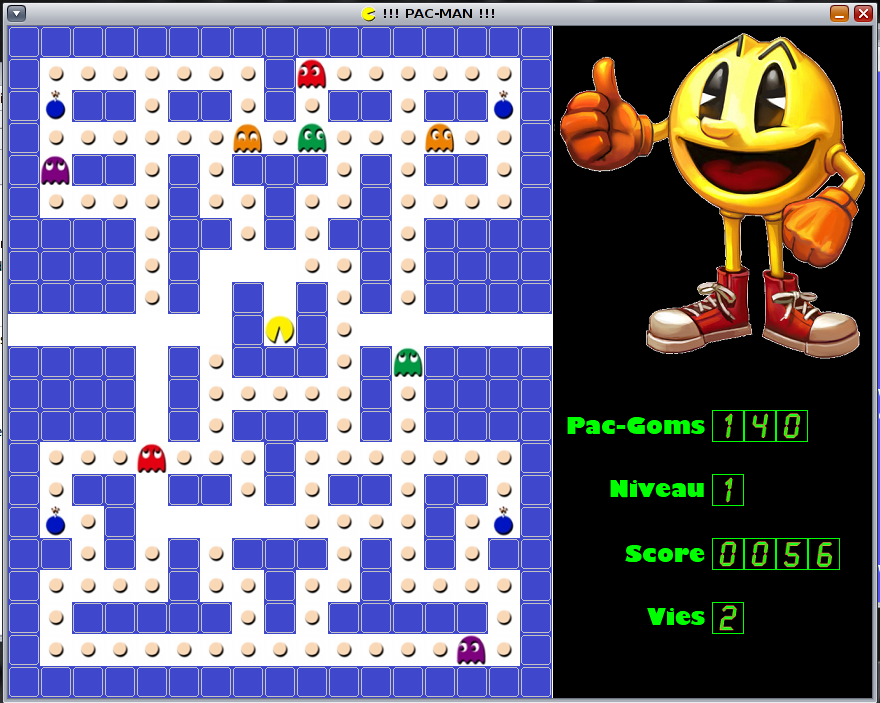

# PacMan
Ce project a été réaliser dans le cadre du cours de Thead à l’Inpres (HEPL).

Développement du jeu Pac-Man sous Linux Solaris, utilisation de la librairie SDL pour l’interface. Utilisation de la mémoire partagée, des signaux ainsi que les pipe/file de messages pour la communication entre les différents threads. Utilisation de threads synchrones et asynchrones.

